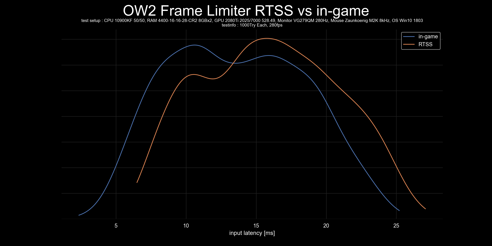

# plot-input-latency
 Script to graph input latency data.

Box-and-whisker plot (box plot) are commonly used, but while box plot can represent statistical values (Min, Q1, Q2, Q3, Max), box plot may not represent the scatter of the data correctly, especially if not unimodal distributions.
While histogram and KDE (kernel density estimation) can represent the scatter of the data almost correctly, they are not suitable for comparing data as they do not represent statistical values.

Therefore, when creating a graph comparing data scatter, both the comparison criteria and the scatter of each piece of data must be represented visually correctly.

As violinplot is a fusion of KDE and boxplot, I recommend using violinplot as it represents both the statistical values and the scatter of the data.

## Contents
- [violinplot.py](violinplot.py) -> Script to graph input latency data with violinplot  

- [histgraph_step.py](histgraph_step.py) -> Script to graph input latency data with histgraph in step mode  

- [histgraph_poly.py](histgraph_poly.py) -> Script to graph input latency data with histgraph in poly mode  

- [kdeplot.py](kdeplot.py) -> Script to graph input latency data with kdeplot  

## requisite
- csv file containing data on input latency(ms) with no headers and units, separated by line feeds
- python3.8+
- pandas module
- seaborn module
- tkinter module
- matplotlib module
- os module(This must already be installed)

## Usage
1. install python 3.8+.
2. Install the module written above using `pip install pandas seaborn tk matplotlib`.
3. run python file and select csv files.
4. Enter GraphTitle and TestSetup,TestInfo.(ex "RawInput ON vs OFF" and "10900KF, 4000MHz16-17-17-35, 2080Ti" , "1000Try Each, DX12".
5. $GraphTitle_plot.png is in the same folder as plot.py.
