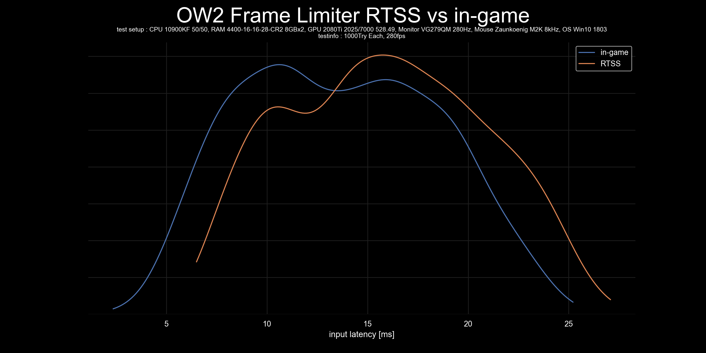
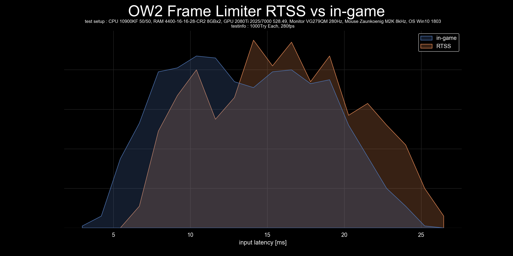
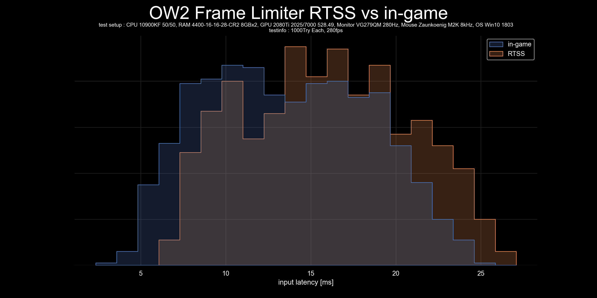

# plot-input-latency
 Script to graph input latency data.    
 
 Visualisation of both,the statistical values and the scatter of multiple data, is necessary to create a graph that can compare the scatter of multiple data.  

 box plot are commonly used, but while box plot can represent statistical values (Min, Q1, Q2, Q3, Max), can not represent scattering of the data correctly, especially if not unimodal distributions[1](https://twitter.com/van__Oijen/status/1108435637277908992).  
 While histogram and KDE (kernel density estimation) can represent scattering of the data almost correctly, can not represent statistical values.    

 I recommend to use violinplot, as violinplot is a complex of KDE and box plot.
## Features
- Read CSV file to create violinplot, kdeplot and histgraph images. (CSV file containing data on input latency (ms) with no headers and units, separated by line feeds).
- In the input window you can enter a title for the graph, a description of the test and the test environment. These are added to the graph and make the graph more visible. (If left blank, they are omitted.)
- Images are saved in the outputs folder. (If the outputs folder does not exist, it will be created automatically.)
- Use the graph title and graph type as the file name when saving the image. This ensures that the contents of the graph can be understood from the file name alone.
- Add a four-digit number to the end of the filename of the image. Avoid overwriting by changing the four-digit number when the same filename is used.

## Contents
- [violinplot_KDElike.py](violinplot_KDElike.py) -> Script to graph input latency data with violinplot  

- [violinplot.py](violinplot.py) -> Script to graph input latency data with violinplot  

- [kdeplot.py](kdeplot.py) -> Script to graph input latency data with kdeplot  

- [histgraph_poly.py](histgraph_poly.py) -> Script to graph input latency data with histgraph in poly mode  

- [histgraph_step.py](histgraph_step.py) -> Script to graph input latency data with histgraph in step mode  

## Requirements
- Windows OS(Vista or 8 or later, depending on Python version)
- CSV file containing data on input latency(ms) with no headers and units, separated by line feeds
- python3.8+
- pandas module
- seaborn module
- tkinter module(in Windows, you have to install tkinter module with the optional feature of the python installer.)
- matplotlib module
- msvc-runtime module(or [Microsoft Visual C++ Redistributable Package](https://aka.ms/vs/17/release/vc_redist.x64.exe))
- os module(This must already be installed)

## Installation and Usage(Windows)
1. install python 3.8+ using [Python installer for Windows](https://www.python.org/downloads/windows/).
   - (in Optional Features, you have to check tcl/tk and IDLE to install tkinter module)
2. Run the below in CMD to install the required modules.
   - `pip install pandas seaborn matplotlib msvc-runtime`
   - (if you installed Microsoft Visual C++ Redistributable Package, you dont need msvc-runtime module.)
3. run python file and select csv files.
4. Enter GraphTitle and TestSetup,TestInfo.(if you left blank, it will be omitted)
5. Plot image is in outputs folder.
