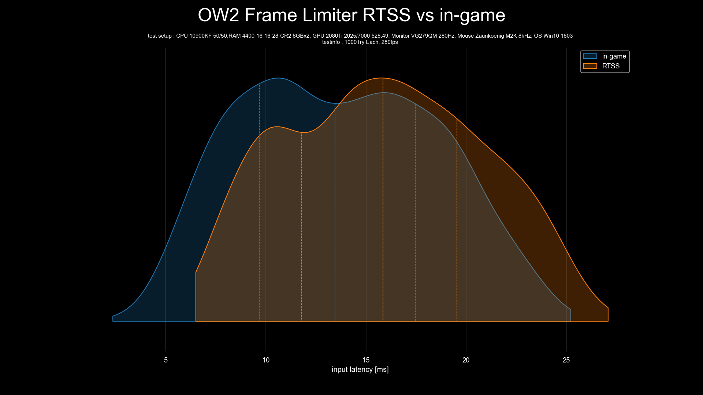

# plot-input-latency
 This script generates a graph to visualise input latency data.

 In order to create graphs for comparing multiple data, it is necessary to visualise both the statistics and the dispersion of the data.

 Box plots are commonly used because they show statistics such as the minimum, first quartile (Q1), median (Q2), third quartile (Q3), and maximum. However, they do not accurately represent the dispersion of the data, especially for non-unimodal distributions.([1](https://web.archive.org/web/20240413161312/https://blog.bioturing.com/2018/05/16/5-reasons-you-should-use-a-violin-graph/), [2](https://twitter.com/van__Oijen/status/1108435637277908992))
 
 (Source: autodeskresearch.com)

 Histograms and Kernel Density Estimation (KDE) effectively illustrate the dispersion of the data, but do not provide statistics.

 To take advantage of both approaches, I recommend using a violin plot, which combines the benefits of KDE and box plots.

## Features
- Read CSV file to create violinplot, kdeplot and histgraph images. (CSV file containing data on input latency (ms) with no headers and units, separated by line feeds).
- In the input window you can enter a title for the graph, a description of the test and the test environment. These are added to the graph and make the graph more visible. (If left blank, they are omitted.)
- Images are saved in the outputs folder. (If the outputs folder does not exist, it will be created automatically.)
- Use the graph title and graph type as the file name when saving the image. This ensures that the contents of the graph can be understood from the file name alone.
- Automatically append a 4-digit number to the end of the filename of the image. If the same file name exists, the 4-digit number is changed to avoid overwriting.

## Contents
- [violinplot_KDElike.py](violinplot_KDElike.py) -> Script to graph input latency data with violinplot  

- [violinplot.py](violinplot.py) -> Script to graph input latency data with violinplot  

- [kdeplot.py](kdeplot.py) -> Script to graph input latency data with kdeplot  

- [histgraph_poly.py](histgraph_poly.py) -> Script to graph input latency data with histgraph in poly mode  

- [histgraph_step.py](histgraph_step.py) -> Script to graph input latency data with histgraph in step mode  

## Requirements
- Windows OS(Vista or 8 or later, depending on Python version)
- CSV file containing data on input latency(ms) with no headers and units, separated by line feeds
- python3.8+
- pandas module
- seaborn module
- tkinter module(in Windows, you have to install tkinter module with the optional feature of the python installer.)
- matplotlib module
- msvc-runtime module(or [Microsoft Visual C++ Redistributable Package](https://aka.ms/vs/17/release/vc_redist.x64.exe))
- os module(This must already be installed)

## Installation and Usage(Windows)
1. install python 3.8+ using [Python installer for Windows](https://www.python.org/downloads/windows/).
   - (in Optional Features, you have to check tcl/tk and IDLE to install tkinter module)
2. Run the below in CMD to install the required modules.
   - `pip install pandas seaborn matplotlib msvc-runtime`
   - (if you installed Microsoft Visual C++ Redistributable Package, you dont need msvc-runtime module.)
3. run python file and select csv files.
4. Enter GraphTitle and TestSetup,TestInfo.(if you left blank, it will be omitted)
5. Plot image is in outputs folder.
