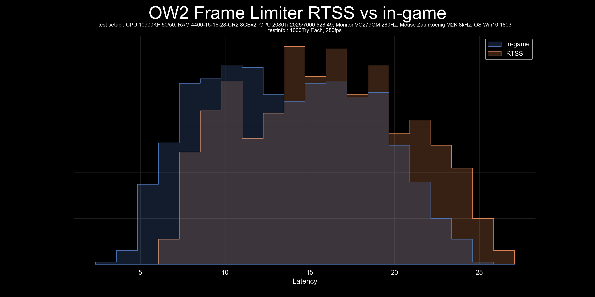

# plot-input-latency
 Script to graph input latency data

## Contents
- [violinplot.py](violinplot.py) -> Script to graph input latency data with violinplot  

- [histgraph_step.py](histgraph_step.py) -> Script to graph input latency data with histgraph in step mode  

- [histgraph_poly.py](histgraph_poly.py) -> Script to graph input latency data with histgraph in poly mode  

- [kdeplot.py](kdeplot.py) -> Script to graph input latency data with kdeplot  

## requisite
- csv file containing data on input latency with no headers and units, separated by line feeds
- python3.8+
- pandas module
- seaborn module
- tkinter module
- matplotlib module
- os module(This must already be installed)

## Usage
1. install python 3.8+.
2. Install the module written above using `pip install pandas seaborn tk matplotlib`.
3. run python file and select csv files.
4. Enter GraphTitle and TestSetup,TestInfo.(ex "RawInput ON vs OFF" and "10900KF, 4000MHz16-17-17-35, 2080Ti" , "1000Try Each, DX12".
5. $GraphTitle_plot.png is in the same folder as plot.py.
