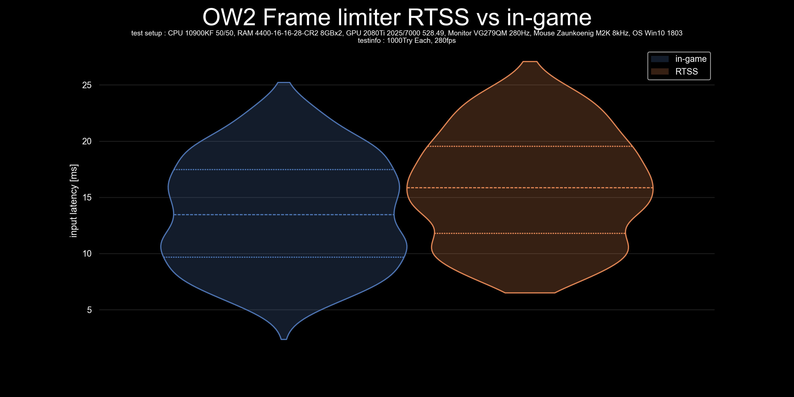

# plot-input-latency
 Script to graph input latency data.    
 
 Visualisation of both,the statistical values and the scatter of multiple data, is necessary to create a graph that can compare the scatter of multiple data.  

 Box-and-whisker plot (box plot) are commonly used, but while box plot can represent statistical values (Min, Q1, Q2, Q3, Max), can not represent scattering of the data correctly, especially if not unimodal distributions[1](https://twitter.com/van__Oijen/status/1108435637277908992).  
 While histogram and KDE (kernel density estimation) can represent scattering of the data almost correctly, can not represent statistical values.    

 I recommend to use violinplot, as violinplot is a complex of KDE and box plot.

## Contents
- [violinplot.py](violinplot.py) -> Script to graph input latency data with violinplot  

- [histgraph_step.py](histgraph_step.py) -> Script to graph input latency data with histgraph in step mode  

- [histgraph_poly.py](histgraph_poly.py) -> Script to graph input latency data with histgraph in poly mode  

- [kdeplot.py](kdeplot.py) -> Script to graph input latency data with kdeplot  

## requisite
- csv file containing data on input latency(ms) with no headers and units, separated by line feeds
- python3.8+
- pandas module
- seaborn module
- tkinter module
- matplotlib module
- os module(This must already be installed)

## Usage
1. install python 3.8+.
2. Install the module written above using `pip install pandas seaborn tk matplotlib`.
3. run python file and select csv files.
4. Enter GraphTitle and TestSetup,TestInfo.(ex "RawInput ON vs OFF" and "10900KF, 4000MHz16-17-17-35, 2080Ti" , "1000Try Each, DX12".
5. $GraphTitle_plot.png is in the same folder as plot.py.
